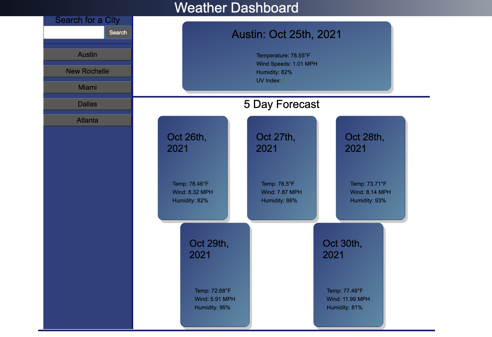

# SERVER APIs: Weather Dashboard

Third-party APIs allow developers to access their data and functionality by making requests with specific parameters to a URL. Developers are often tasked with retrieving data from another application's API and using it in the context of their own. Your challenge is to build a weather dashboard that will run in the browser and feature dynamically updated HTML and CSS.

Use the OpenWeather One Call API to retrieve weather data for cities. Read through the documentation for setup and usage instructions. You will use localStorage to store any persistent data. For more information on how to work with the OpenWeather API, refer to the Full-Stack Blog on how to use API keys.

## Preview

The following image shows the web applications appearance and functionality:

### Links

- [Deployment Link](https://hyanez.github.io/Weather-Dashboard/ "Deployment Link")
- [Github Link](https://github.com/hyanez/Weather-Dashboard "Github Link")
